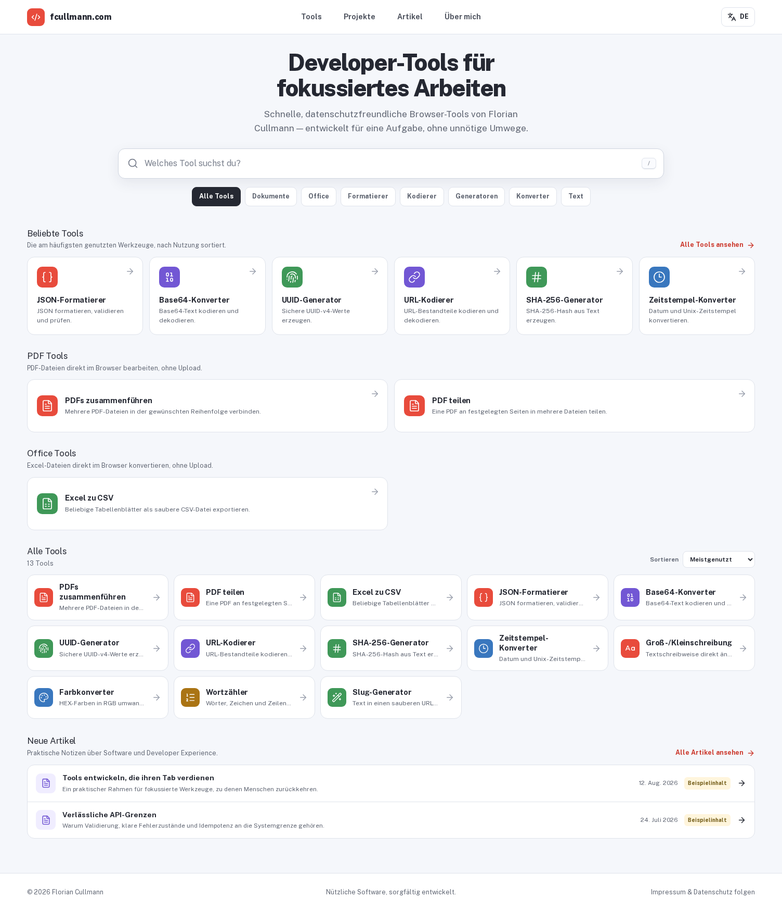

# fcullmann.com

[](https://github.com/Florian-Cullmann/fcullmann-tools/actions/workflows/ci.yml)

Source code for [fcullmann.com](https://fcullmann.com), a bilingual personal site with a growing collection of small browser-based tools.



## Features

- Searchable tool catalogue with English and German content
- Local PDF merging, visual splitting, and PDF/JPG conversion
- Excel-to-CSV conversion with worksheet selection and preview
- JSON, Base64, UUID, hashing, timestamp, text, color, and URL utilities
- Project and article pages with localized metadata
- Single-user admin area for tools and articles
- Demo content fallback when no database is configured
- Sitemap, structured data, `robots.txt`, and `llms.txt`

Files selected in the PDF and Office tools are processed in the browser. Their contents are not uploaded to the application server.

## Stack

- Next.js 16, React 19, and TypeScript
- PostgreSQL and Prisma
- Auth.js / NextAuth
- PDF-Lib, PDF.js, JSZip, and ExcelJS
- Vitest and Playwright

## Getting started

Node.js 22.13 or newer and npm are recommended. The public site can run without a database using the bundled demo content:

```bash
npm ci
npm run dev
```

Open [http://localhost:3000](http://localhost:3000).

### Database and admin area

For the full setup, copy the example environment file and start PostgreSQL:

```bash
cp .env.example .env
docker compose up -d postgres
npm run db:generate
npm run db:deploy
npm run db:seed
npm run dev
```

Create the admin password hash before editing `.env`:

```bash
node -e "require('bcryptjs').hash(process.argv[1], 12).then(console.log)" 'your-password'
```

Generate `AUTH_SECRET` with a cryptographically secure random value, for example:

```bash
openssl rand -base64 32
```

| Variable | Purpose |
| --- | --- |
| `DATABASE_URL` | PostgreSQL connection string |
| `AUTH_SECRET` | Session signing secret |
| `ADMIN_EMAIL` | Login address for the admin account |
| `ADMIN_PASSWORD_HASH` | Bcrypt hash of the admin password |
| `NEXTAUTH_URL` | Canonical URL used by Auth.js |
| `NEXT_PUBLIC_SITE_URL` | Public base URL used for metadata and indexes |

## Commands

| Command | Description |
| --- | --- |
| `npm run dev` | Start the development server |
| `npm run build` | Build the standalone production bundle |
| `npm run start` | Start the standalone production server |
| `npm run lint` | Run ESLint |
| `npm run typecheck` | Check TypeScript without emitting files |
| `npm test` | Run the unit tests |
| `npm run test:ui` | Run the catalogue and navigation browser checks |
| `npm run test:pdf-split` | Verify PDF splitting and ZIP output in a browser |
| `npm run test:pdf-images` | Verify PDF/JPG conversion and downloads in a browser |
| `npm run test:excel-to-csv` | Verify XLSX import and CSV download in a browser |

The Playwright checks expect the application at `http://127.0.0.1:3000`. Set `CAPTURE_ORIGIN` to use another address.

## Project structure

```text
app/                 Next.js routes, metadata, and API handlers
components/home/     Homepage catalogue
components/tools/    Interactive tool workspaces
lib/content/         Database repository and demo content
lib/tools/           Browser-side document processing
prisma/              Schema, migrations, and seed data
scripts/             Browser verification scripts
```

## Production

`next.config.ts` enables Next.js standalone output. `npm run build` prepares the runtime bundle and its static assets in `.next/standalone`; `npm run start` launches the generated server.

Apply database migrations before starting a new release:

```bash
npm run db:deploy
npm run build
npm run start
```

Production deployments should provide TLS termination, PostgreSQL backups, and all runtime secrets through the host environment.
